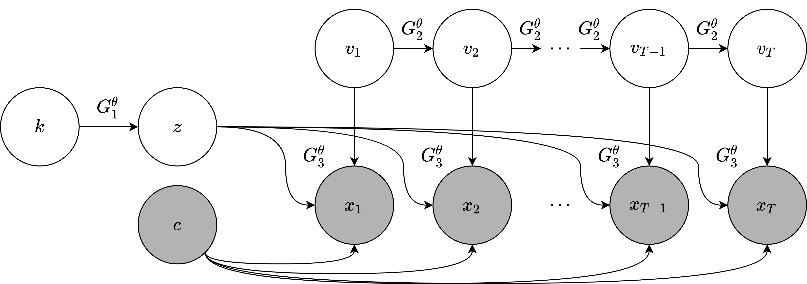
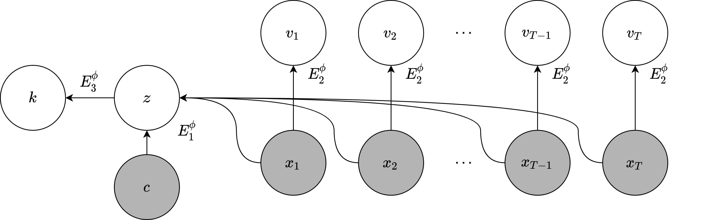

# Codebase for "Composing graphical models with generative adversarial networks for EEG signal modeling"

Paper link: https://ieeexplore.ieee.org/document/9747783

## Directed graphical models for EEG signal modeling

Generative process:



Inference process:



Each time step corresponds to a $\delta$-second multi-channel signal. Shaded nodes represent observed variables. Clear nodes represent latent variables. Directed edges indicate statistical dependencies between variables.

Variables $k$, $z$, and $c$ represent Gaussian mixture indicators, sampling noise, and conditions, respectively. $v_t$ are latent states and $x_t$ are EEG segments.

## Setup

To install the dependencies, you can run in your terminal:
```sh
pip install -r requirements.txt
```

Experimental dataset can be downloaded at: https://zenodo.org/record/8408937

## Usage

The code is structured as follows:
- `data.py` contains functions to transform and feed the data to the model.
- `models.py` defines deep neural network architectures.
- `utils.py` has utilities for evaluation and plottings.
- `train.py` is the main entry to run the training process.
- `eval.ipynb` runs the evaluation.

## Citation

If you find this code helpful, please cite our paper:

    @inproceedings{vo2022composing,
        title={Composing Graphical Models with Generative Adversarial Networks for EEG Signal Modeling},
        author={Vo, Khuong and Vishwanath, Manoj and Srinivasan, Ramesh and Dutt, Nikil and Cao, Hung},
        booktitle={ICASSP 2022-2022 IEEE International Conference on Acoustics, Speech and Signal Processing (ICASSP)},
        pages={1231--1235},
        year={2022},
        organization={IEEE}
    }